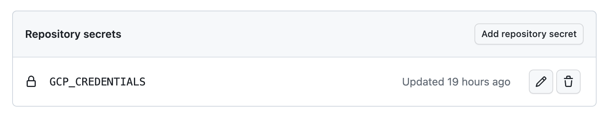

# GCP infrastructure setup

## Bootstrapping

### Prerequisites

- `gcloud` CLI
- `jq` (on macOS, can be installed with `brew install jq`)
- The project ID that you want to target

### Very first run

We will assume that our newly-created GCP project is completely blank. That is, no APIs enabled, no service accounts available etc. etc.

Before we can even run our very first github actions, there's a couple of essential steps we need to perform from our own machine to create the bare minimum that GH will need.

Start by authenticating the `gcloud` CLI with your GCP account by running:

```
gcloud auth login
```

Now, let's run the `create-bootstrap-sa.sh` bash script:

```
sh ./scripts/create-bootstrap-sa.sh project-id region
```

Replace `project-id` and `region` with the relevant values for your project.

### Result

The previous script will do a bunch of things:

- Enable the IAM API
- Create a new service account called `infra-bootstrap`
- Create a new role called `infra.bootstrap` with the minimal set of permissions needed to run the Terraform stack
- Assign the `infra.bootstrap` role to the `infra-bootstrap` service account **for the next 12 hours**
- Create a new private key for the SA, and download it into a `sa_key.json` file inside this directory
- Create a new storage bucket that will contain the Terraform stack state

We'll use the contents of `sa_key.json` and add them to a `GCP_CREDENTIALS` secret in this same Github repository.



It is important to note that the permissions we granted the `infra-bootstrap` service account will only be valid for 12 hours after they have been granted. The purpose of this account should be quite short-lived, so it's better to revoke permissions if they are not used.

In case you need to renew the policy binding for a further 12 hours, you can run:

```
sh ./scripts/renew-sa-role-binding.sh project-id
```

Replacing `project-id` with your own value.

**Warning:** careful not to leak the private key anywhere. Once you add it to the repo secrets, best to remove it from your local machine